# Op-amp Lib

## Behaviour Analysis

### Golden Rules

### Silver Rules

## Topologies

### Inverting 

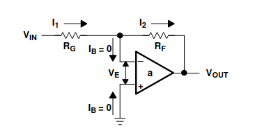

### Non-inverting

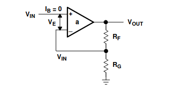

### Summing

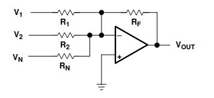

### Differential

### Inverting differentiator
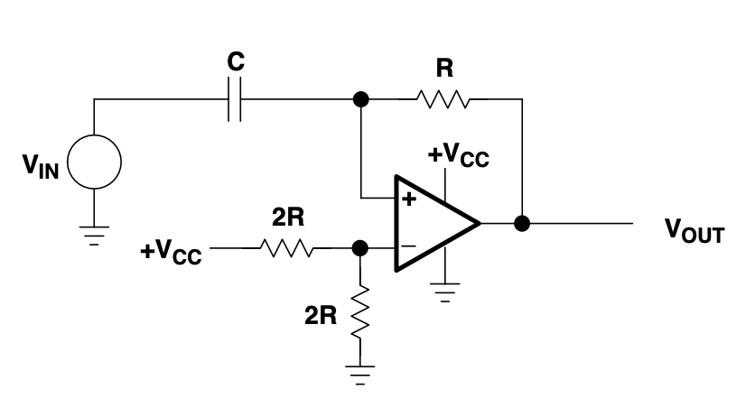

### Inverting differentiator with noise filter
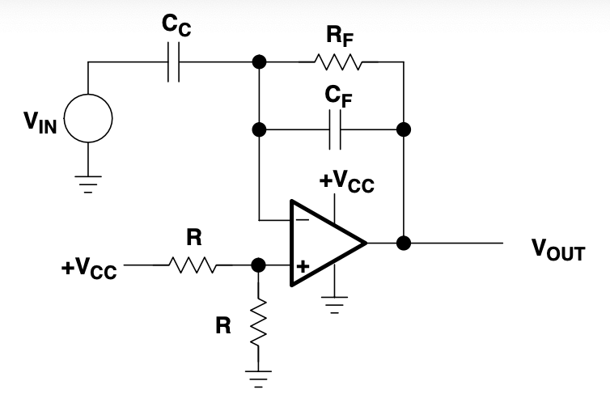

### Inverting integrator
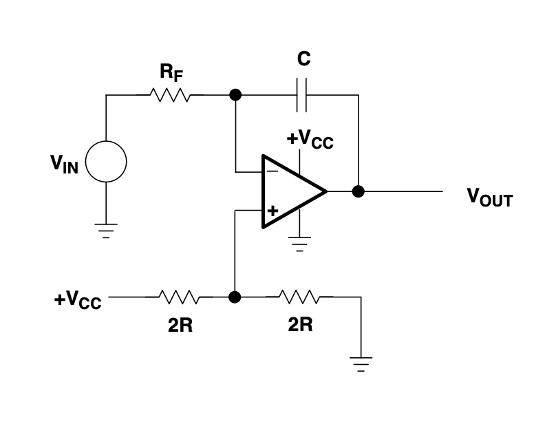

### Inverting integrator with input current compensation
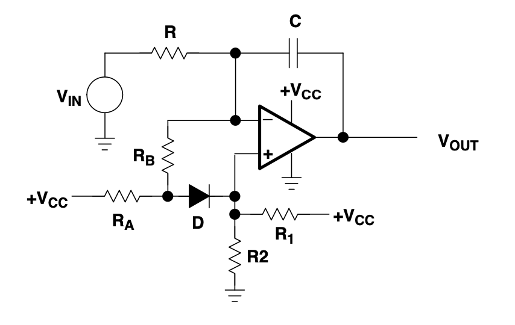

### Inverting integrator with drift compensation
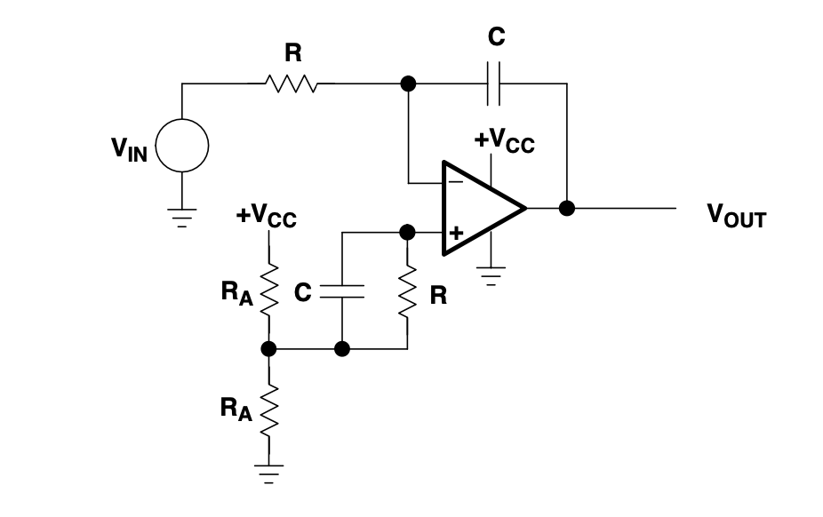

### Inverting integrator with mechanical reset
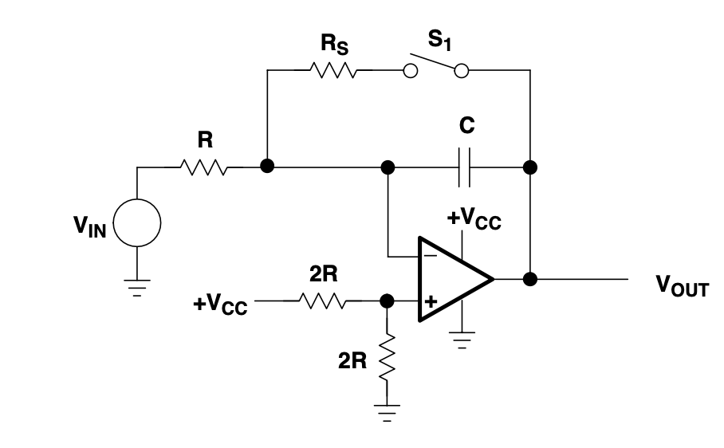

### Inverting integrator with electronic reset
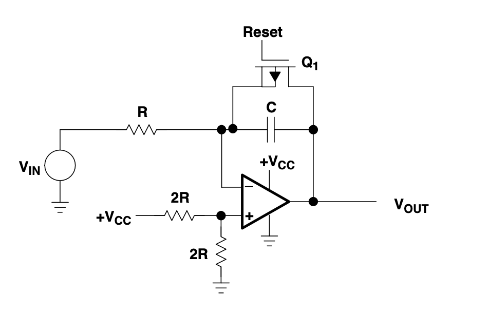

### Inverting integrator with resisitive reset 
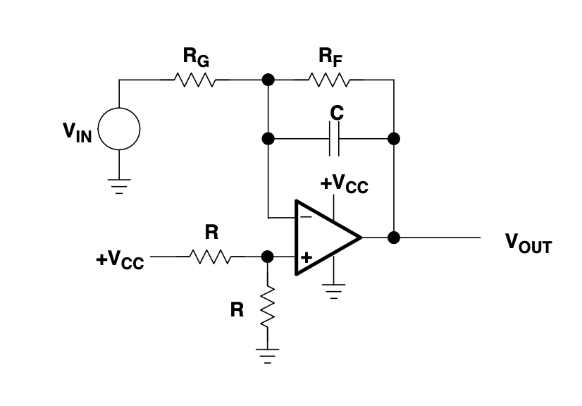

### Non-inverting integrator with inverting buffer
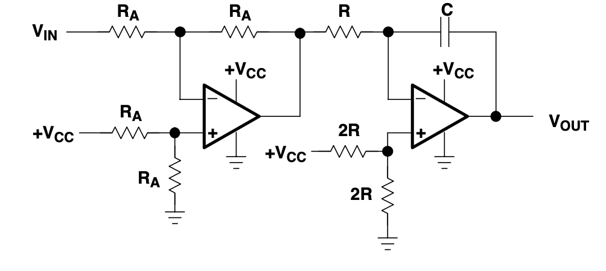

### Non-inverting integrator approximation
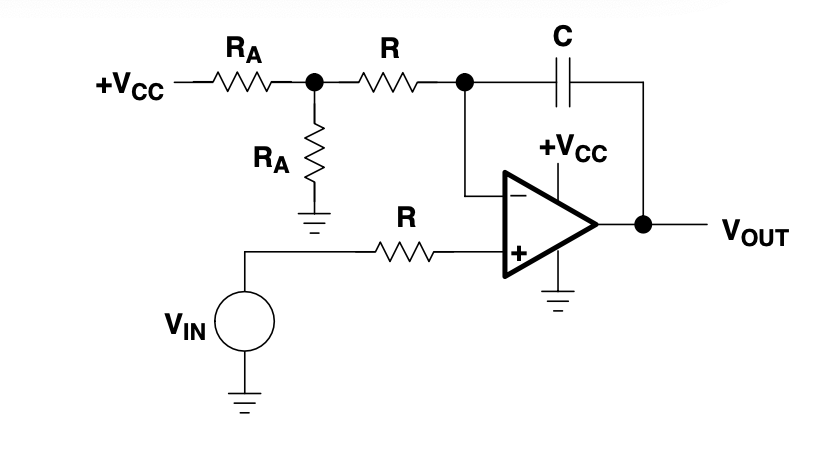

## Performance Analysis 

## Bill of Materials

### DT830D Digital Multimeter

### Analog Discovery Pro 2

### BX-4135 Breadboard

### KiCad

### WaveForms

## SPICE Simulation Results

## Test Circuit Results
