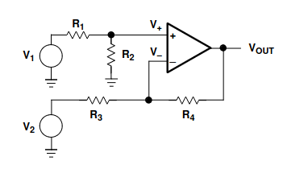

# Op-amp Lib

## Behaviour Analysis

### Golden Rules

### Silver Rules

## Topologies

### Inverting 

### Non-inverting

### Summing

### Differential

### Differentiator

### Integrator

## Performance Analysis 

## Build of Materials

### DT830D Digital Multimeter

### Analog Discovery Pro 2

### BX-4135 Breadboard

### KiCad

### WaveForms

## SPICE Simulation Results

## Test Circuit Results
