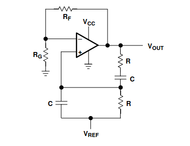
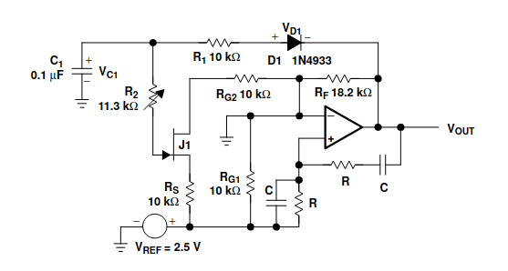
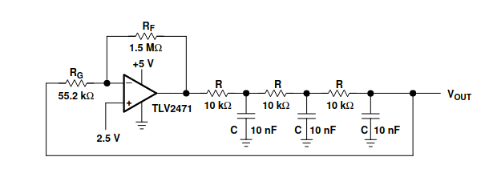
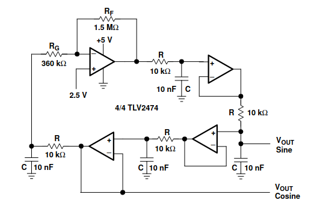
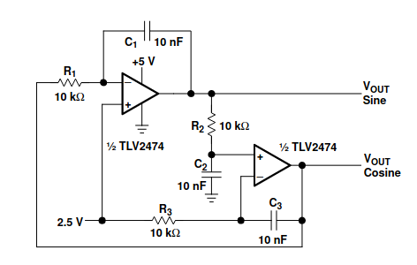

# Oscillators

## Types of Oscillators

## Topologies

### Wien-Bridge

### Wien-Bridge with automatic gain control

### Phase Shift Oscillator

### Buffered Phase Shift Oscillator

### Bubba Oscillator

### Quadrature Oscillator

### Triangle Oscillator
